# 小樂園 Game Hub (Game Center)

一個基於 Java Swing 互動式視窗技術開發的多功能遊戲選單平台。

## 示範影片:

[https://youtu.be/qUpZ_M1_nqw](https://youtu.be/qUpZ_M1_nqw)

## 🎮 包含遊戲與核心機制

### 1. OOXX (井字棋)

- 經典的雙人本地對弈遊戲，具備即時勝負判定與平手檢查機制。

### 2. 1A2B (猜數字)

- 考驗邏輯推理的經典數字謎題，具備嚴謹的輸入防呆機制（檢查重複數字、字數長度等）。

### 3. 小恐龍 (Dino Game)

- **進化型動態速度**：分數隨遊玩影格（Frames）動態平滑增加（每秒約 50 分），遊戲速度隨分數呈線性成長，挑戰玩家極限。
- **智慧型安全過渡期**：開局 `70 分` 內為安全散步期，百分之百不生成任何障礙物，讓玩家有充足的準備時間。
- **分流式關卡節奏**：
  - **Stage 1 (0 ~ 699分)**：純仙人掌階段（隨機出現單顆或叢生仙人掌），讓玩家熟悉跳躍物理拋物線。
  - **Stage 2 之後 (700分以上)**：解鎖翼手龍大亂鬥。仙人掌與翼手龍以 50/50 機率隨機混編出現。
- **隨機翼手龍高度機制**：翼手龍會隨機出現於兩種高度：
  - **高空翼手龍**（`GROUND_Y - 10`）：必須按住 `▼ (下方向鍵)` 蹲下躲過。
  - **低空翼手龍**（`GROUND_Y + 20`）：貼近地面飛過，必須使用跳躍避開（此時蹲下會被撞到）。
- **精密動態 Hitbox 偵測**：當恐龍按住下方向鍵時，畫面會即時切換至 `dino_sit.png`，且**碰撞箱高度同步砍半（40 像素降至 20 像素）並貼緊地面**，確保精準的實體判定。
- **動態日夜系統 (Stage 晉級)**：分數每達到 `700 分的倍數`（如 700, 1400, 2100...），背景會瞬間在「極簡白」與「電子霓虹深灰」之間切換，營造出強烈的關卡推進感。

---

## 🏗️ 專案架構與運行流程

本專案採用物件導向設計，由 `Main` 作為中央視窗管理器（`JFrame`），並利用 `CardLayout` 進行各個遊戲面板（`JPanel`）的無縫切換。

以下為整個專案的控制結構與 `DinoGame` 核心主循環的流程圖（此架構圖支援在 GitHub 或 Markdown 編輯器中自動渲染）：

```mermaid
graph TD
    %% 應用程式結構 %%
    subgraph App_Structure [Game Hub 視窗導航結構]
        Main[Main.java JFrame] -->|CardLayout| Menu[主選單 JPanel]
        Main -->|CardLayout| OOXX[OOXX 面板]
        Main -->|CardLayout| Game1A2B[1A2B 面板]
        Main -->|CardLayout| DinoGame[DinoGame 面板]
        Menu -->|點擊按鈕| Main
        DinoGame -->|按下 ESC| Main
    end

    %% 小恐龍遊戲循環 %%
    subgraph Dino_Loop [DinoGame 核心遊戲循環每 20ms]
        Timer[Swing Timer] -->|觸發 actionPerformed| UpdateScore[分數 score++ / 速度 gameSpeed 成長]
        UpdateScore --> Hitbox[動態 Hitbox 偵測: 判斷 isCrouching 與地面高度]
        Hitbox --> Physics[更新角色 Y 軸位移與重力加速度]
  
        Physics --> SpawnCheck{分數 > 70 且 滿足最小間距?}
  
        SpawnCheck -->|否: 安全期/冷卻中| MoveObstacles[移動現有障礙物]
        SpawnCheck -->|是: 隨機機率| TypeCheck{score < 700 ?}
  
        TypeCheck -->|是| SpawnCactus[100% 生成仙人掌 單顆/叢生]
        TypeCheck -->|否| SpawnRandom[50% 仙人掌 / 50% 翼手龍]
  
        SpawnCactus --> MoveObstacles
        SpawnRandom --> MoveObstacles
  
        MoveObstacles --> CollisionCheck{障礙物與恐龍 Hitbox 相交?}
  
        CollisionCheck -->|是| GameOver[isGameOver = true / 停止 Timer]
        CollisionCheck -->|否| Repaint[觸發 repaint 渲染畫面]
  
        Repaint --> DayNight{score / 700 餘數判斷}
  
        DayNight -->|奇數關卡| NightBg[渲染黑夜背景 + 繪製角色與障礙物圖片]
        DayNight -->|偶數關卡| DayBg[渲染白天背景 + 繪製角色與障礙物圖片]
    end

    classDef mainStyle fill:#2b5c8f,stroke:#1d3d60,stroke-width:2px,color:#fff;
    classDef gameStyle fill:#479477,stroke:#2d634f,stroke-width:2px,color:#fff;
  
    class Main,Menu mainStyle;
    class DinoGame,OOXX,Game1A2B gameStyle;
```

